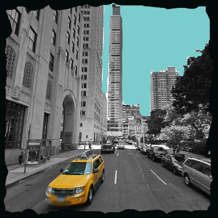

Editor for Google Street View Images
==========================

<a href='http://bebebebebe.github.io/street-editor/'>Demo</a>

[in progress]

JavaScript Tool for finding and editing still photos from Google Street View. Uses Google Street View API, and Aviary photo editor API.

